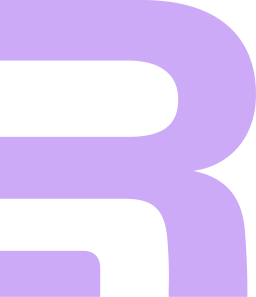
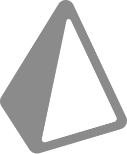

안녕하세요 단순함이 최고의 미덕이라고 생각하고 즐겁게 개발하는 개발자 김경현입니다.
 
 
UX, Design Pattern, 폴더 구조에 관심이 많으며, 지식을 나누는 것을 좋아합니다.

 최근은 <a href="https://remix.run/">Remix.run</a>에 푹 빠져있습니다. 

<h2 align='center' >🍩 | About me </h2>
<ul align='center'>
  <li><h3>❌ 파일당 코드 160줄을 넘기지 않습니다.</h3></li>
( 비즈니스 로직, 스타일 등을 JSX와 분리하여 사용하는 것을 좋아합니다. )
 
 
<li><h3>👨‍💻 선언형 프로그래밍을 좋아합니다</h3></li>
(lodash와 같은 utility library, custom hooks, method등을 즐겨 사용합니다. )
 
 
<li><h3>:nut_and_bolt: 중첩 조건, 반복문 사용을 지양합니다.</h3></li>
( 복잡한 비즈니스 로직이 있다면 최대한 심플한 함수들로 쪼개어 조합합니다. )
 
 
<li><h3> 방법론, 기술스택, 디자인 패턴 등의 맹목적인 사용을 지양합니다.</h3></li>
( 상태에 대하여 Global state, contextAPI, props drilling 등 상황에 따라 적절하게 사용합니다. )
 
 
<li><h3>💬 소통하는 것을 매우 좋아합니다.</h3> </li>
( "우리집 고양이 츄르를 좋아해" 에서부터 기술적인 소통까지 가리지 않습니다. )
 
 
<li><h3>🧐 언제나 새로운 것을 배우는걸 좋아합니다.</h3></li>
(  간단히라도 배운 것을 적용해 보려 합니다. )
<a href="https://github.com/kich555?tab=repositories">Checkout my repositories</a> 
 
 
<li><h3>📙 제 이력서입니다. 많관부입니다.</h3></li>
  ( <a href="https://www.stanleylim.me/resume/resume.pdf">resume</a>. )
 
 
<li><h3>🎉 Fun Fact: 정말 우리집 고양이는 츄르를 좋아합니다.</h3></li>
</ul>

<h2 align='center'>🚀 Some Tools I Use</h2>
 

 
 

  
  

  
  

<!--START_SECTION:waka-->
<!--END_SECTION:waka-->

 

