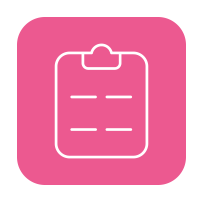

안녕하세요 단순함이 최고의 미덕이라고 생각하고 즐겁게 개발하는 개발자 김경현입니다.
 
 
UX 와 생산성에 관심이 많으며, 지식을 나누는 것을 좋아합니다.
 
특히나 요즘은 해결해야 할 To Do 가 많기때문에 생산성에 집중하고 있습니다. 
 
done is better than perfect라는 말을 좋아합니다. 

  요즈음에는 디자인시스템을 어떻게 차차 발전시켜 나갈지, 모노레포를 어떻게 효율적으로 사용할지, FE에서 BFF / WAS를 어떻게 꾸려갈 수 있을지 고민하고 있습니다. 

<h2 align='center' >🍩 | About me </h2>

  <ul align='center'>
    <li>
      <h3>❌ 파일당 코드 200줄을 넘기지 않습니다.</h3>
    </li>
    ( 컴포넌트는 복잡합니다. VIEW, 비즈니스 로직, 상태관리 등을 따로 추상화하거나, 분리해서 사용하는 것을 좋아합니다. )
     
     
    <li>
      <h3>👨‍💻 선언형 프로그래밍을 좋아합니다</h3>
    </li>
    (lodash와 같은 utility library, custom hooks, React Lazy, Suspense, ErrorBoundary, React Query등을 즐겨 사용합니다.)
     
     
    <li>
      <h3>:nut_and_bolt: 중첩 조건, 반복문 사용을 지양합니다.</h3>
    </li>
    ( 복잡한 비즈니스 로직이 있다면 최대한 심플한 함수들로 쪼개어 조합합니다. )
     
     
    <li>
      <h3>📝 방법론, 기술스택, 디자인 패턴 등의 맹목적인 사용을 지양합니다.</h3>
    </li>
    ( A상황에서의 Best Choice가 B상황에서도 Best일 거란 보장은 없습니다. )
     
     
    <li>
      <h3>상태의 사용은 신중하고, 명확한 이유가 있어야 합니다.</h3>
    </li>
    ( UI상태, 서버 상태등을 분리해서 사용하며, 상태 라이브러리, contextAPI, props drilling 등 상황에 따라 적절하게 사용합니다. )
     
     
    <li>
      <h3>💬 소통하는 것을 매우 좋아합니다.</h3> 
    </li>
    ( 단순 업무의 목적성을 구체화 하는 것을 넘어서, 좋은 분위기는 좋은 결과물을 가져올 수 있다고 믿고있습니다. )
     
     
    <li>
      <h3>🧐 언제나 새로운 것을 배우고 시도해 보는 것을 좋아합니다.</h3>
    </li>
      

      
Check out my project 👀

        <a href="https://github.com/kich555/Style-Playground">Style Playground<a>
        
        
           
           
        
           
           
        <a href="https://github.com/kich555/To-Do-List-with-Remix.run">To Do List with Remix<a>
        
        
        
        
        
           
           
        
           
           
        <a href="https://congbab.com/">명도소송 웹 서비스 Congbab<a>
        
        
          
           
           
        
           
           
        WhiskyNavi Official Web Site 제작중...
           
           
          

    <li>
      <h3>📝 개발에 관한 인사이트를 기록합니다.</h3>
    </li>
      

      
Check out my posts 👀

       
        <li><a href="https://kich555.notion.site/UX-a09303b3d2f8497b9250937d86511820">UX에 대하여<a></li>
        <li><a href="https://kich555.notion.site/7e69785416eb4607bf56951b14507137">잘못된 추상화<a></li>
        <li><a href="https://kich555.notion.site/State-Colocation-with-React-Form-07c9e5b1f9dd4378807f0e1a2f603008">상태 같이두기 with react form<a></li>
          <li><a href="https://kich555.notion.site/State-Colocation-with-React-Form-07c9e5b1f9dd4378807f0e1a2f603008">useState vs useReducer<a></li>
        <li><a href="https://kich555.notion.site/Re-render-9b464a0217fc4634b1d27b59c7b53cff">Re-render에 대한 착각<a></li>
        <li><a href="https://kich555.notion.site/Remix-Form-Example-53078300126948d788793153138a1b37">Remix Form Example<a></li>
        <li><a href="https://kich555.notion.site/Mixed-Content-Issue-bcd51aac12a84ac58fedc496c8af5078">About Mixed Content<a></li>
        <li><a href="https://kich555.notion.site/XSS-69558fcdb39c40e4b94ce77f02dac548">About XSS<a></li>
        <li><a href="https://kich555.notion.site/About-CORS-b33e5886c8ca4f27beb751358011e789">About CORS<a></li>
      

     
    <li>
      <h3>📙 제 <a href="https://kich555.notion.site/badec3f62f9341119155fe3b8d494725">이력서</a>입니다.</h3>
    </li>
     
  </ul>

<h2 align='center'>🚀 Some Tools I Use</h2>
 

  
  
  
  
  
  
  
  
  
  
  
  
  
  
  

  

 

 
 

  
  

  
  

